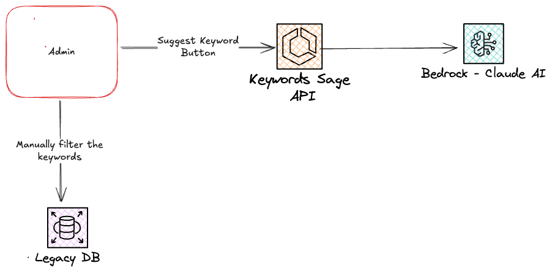

# Keywords Sage

## Overview

Keywords Sage leverages LLM AWS solution to deal with LLMs. This project is born out of the necessity to generate search keywords for our different partners. Users on Admin will then decide which of the AI suggestions are valid for them.

## API Specification

```
POST  into https://keywords-sage.{env}.unidays.io/generate-keywords
```

with payload:

```json
{
  "partnerName": "string",
  "initialKeywords": ["string"]
}
```



## How to Guides

- [How to Set Up the Project](./docs/howToGuides/setup.md)
- [How to Deploy a Feature or Change to Production](./docs/howToGuides/deploying.md)
- [How to Run Tests](./docs/howToGuides/tests.md)

## Reference

- [Model Specification](./docs/reference/llm.md)

## TO DO list

- If this api keeps growing add new relic
